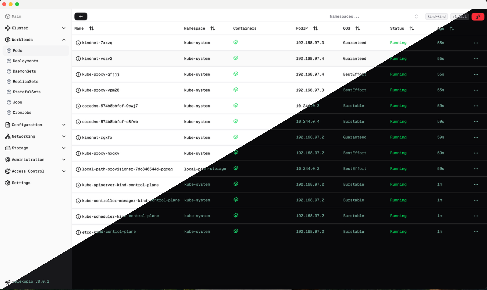
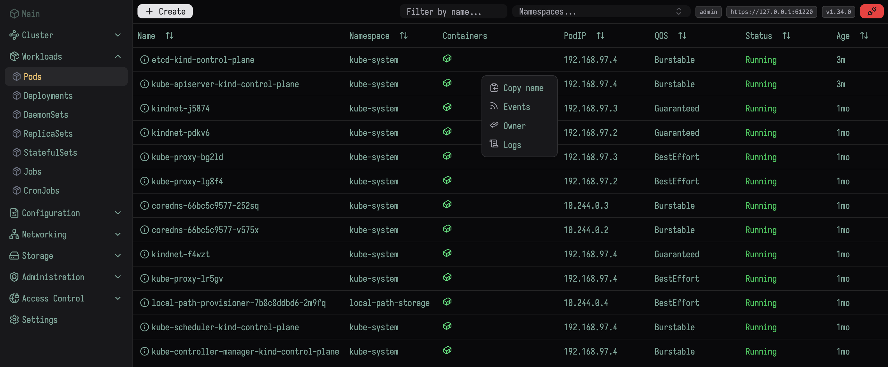
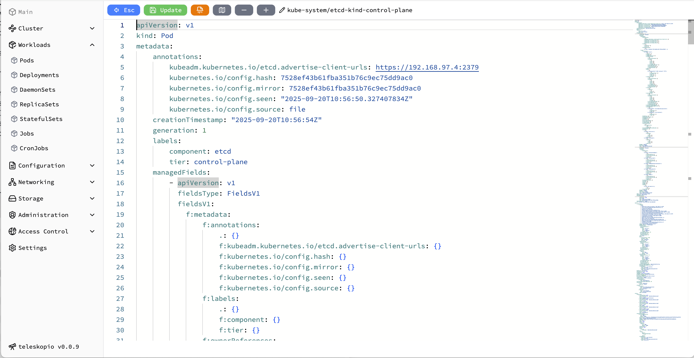
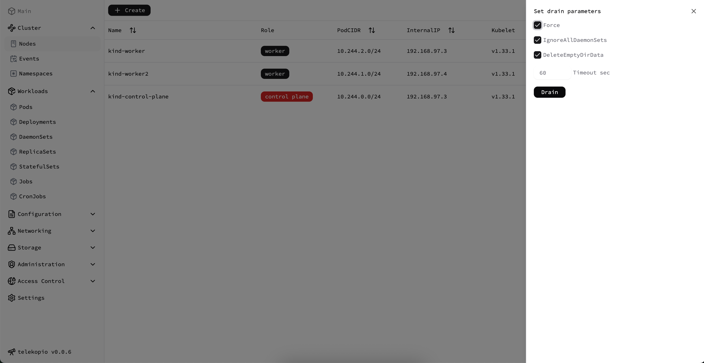
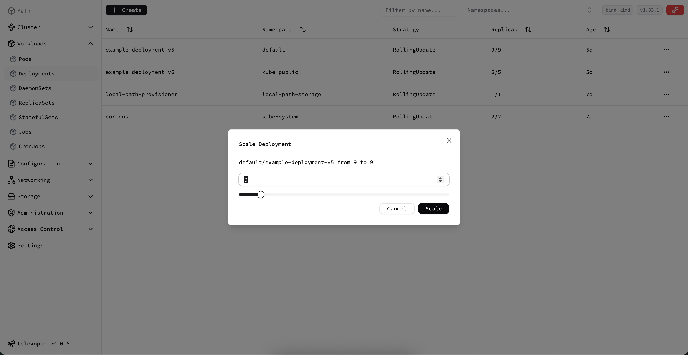

<h2 align="center">
    teleskopio is an open-source small and beautiful Kubernetes Web client.
</h2>
<p align="center">
    
</p>

[](https://github.com/roman-kiselenko/teleskopio/actions/workflows/ci.yaml)
[](https://github.com/roman-kiselenko/teleskopio/actions/workflows/docker.yaml)

- [Features](#features)
- [Planned Features](#planned-features)
- [Screenshots](#screenshots)
- [Stack](#stack)
- [Install](#install)
- [Keymaps](#keymaps)

## Features

- Multiple configs support - switch between clusters effortlessly. teleskopio reads `$KUBECONFIG` variable and check `config.yaml` file.
- Simple JWT token authorization.
- Admin and Viewer role - Full access (admin) or Read Only access (viewer) to cluster.
- Cluster overview - get a high-level view of cluster health and activity.
- Resource editor/creator - integrated [Monaco Editor](https://microsoft.github.io/monaco-editor/) with syntax highlighting.
- Live updates - real-time resource changes with Kubernetes watchers.
- Pod logs and events - inspect logs and event history directly in the UI.
- Owner links - navigate from a resource to its owner.
- Multiple font options - customize the UI appearance.
- Filter `CTRL + F` any resource.
- Jump to section `CTRL + J` any menu.
- Light and dark themes.

---

## Planned Features

- Helm integration.
- Kubernetes resource schemas per API version.
- Resource metrics - CPU, memory, and other usage statistics.

---

## Screenshots

<p align="center">
    
    
    
    
    
</p>

## Stack

- **Golang** - Kubernetes golang client.
- **React** - responsive and modern frontend.
- **[shadcn/ui](https://ui.shadcn.com/)** + **Tailwind CSS** - clean and flexible UI components.
- **[Monaco Editor](https://microsoft.github.io/monaco-editor/)** - powerful code editor with syntax highlighting.
- **Dynamic resources** - auto-loading resources for flexible navigation.
- **Kubernetes watchers** - instant updates from the cluster.

---

## Install

### Linux

Download [release](https://github.com/roman-kiselenko/teleskopio/releases).

### MacOS

Use brew (ARM and Intel):

1. `brew tap roman-kiselenko/homebrew-teleskopio`
1. `brew install --cask teleskopio`

### Docker

1. Pull docker image from [Packages](https://github.com/roman-kiselenko/teleskopio/pkgs/container/teleskopio)

```sh
docker pull ghcr.io/roman-kiselenko/teleskopio:latest
```

2. Generate config

```sh
docker run -it --rm ghcr.io/roman-kiselenko/teleskopio:latest config > config.yaml
```

3. Edit config

```sh
$ htpasswd -nbB admin MySecret123 # apache2-utils
> admin:$2y$05$U7puDu7wKOMP6i4eI1nO4ux909bH8FuPadEQq2oxx7SRXrBh3xJIG
vim config.yaml # edit confAig and add admin user
# add kubeconfig content to kube.configs
# check example in config.yaml
```

4. Run

Run with `--network=host` if you're using kind cluster

```bash
docker run -it --rm --network=host -p 3080:3080 -v $(pwd)/config.yaml:/usr/bin/config.yaml ghcr.io/roman-kiselenko/teleskopio:latest --config=/usr/bin/config.yaml
```

Or run with docker network

```bash
docker run -it --rm -p 3080:3080 -v $(pwd)/config.yaml:/usr/bin/config.yaml ghcr.io/roman-kiselenko/teleskopio:latest --config=/usr/bin/config.yaml
5:47AM INF set loglevel level=DEBUG
5:47AM INF version version=""
5:47AM INF initialize web server addr=:3080
...
```

#### Run

1. Generate config `teleskopio config > config.yaml`
1. `teleskopio`

---

## Keymaps

1. Hide/Show sidebar `CTRL+B`
1. Get back `ESC`
1. In editor `CTRL+S` save
1. `CTRL+J` Jump to some section (Pod, Deployments, Configuration e.t.c.)

## Development

1. `pnpm install`
1. `make run-frontend`
1. `make run-backend`
1. `make lint`

## Contributing

**teleskopio** is an open-source project, and contributions are welcome.
