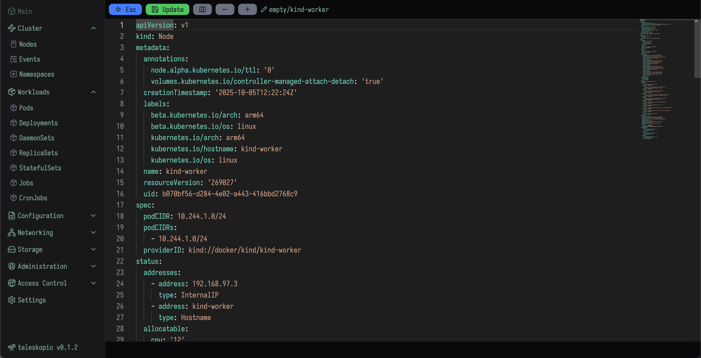
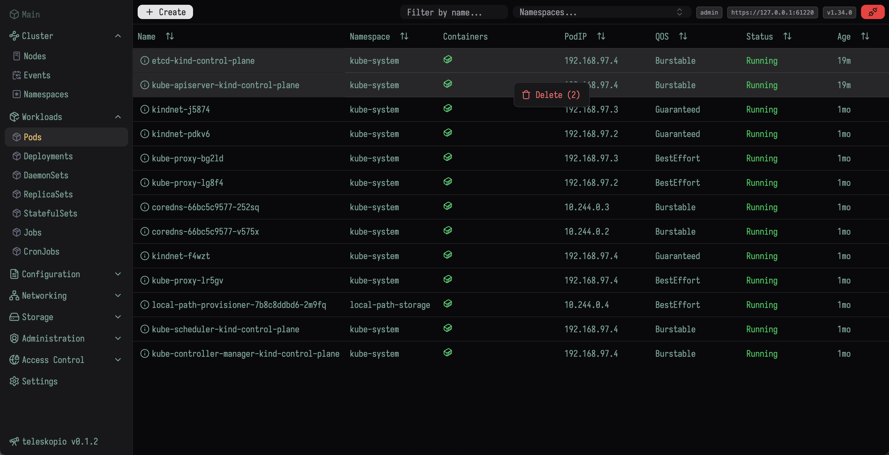
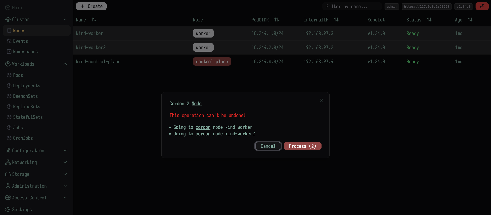
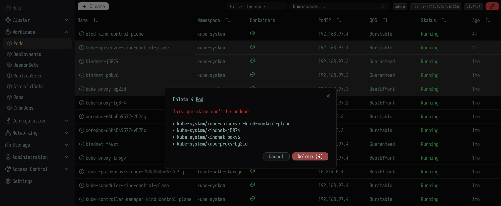

<h2 align="center">
    <code>teleskopio</code> is an open-source small and beautiful Kubernetes web client.
</h2>
<p align="center">
  
  
</p>

<p align="center">
    
</p>

- [Features](#features)
- [Planned Features](#planned-features)
- [Stack](#stack)
- [Install](#install)
- [Keymaps](#keymaps)
- [Screenshots](#screenshots)
- [Disclaimer](#disclaimer)

## Features

- Multiple configs support - switch between clusters effortlessly. teleskopio reads `$KUBECONFIG` variable and check `config.yaml` file.
- Simple JWT token authorization.
- Admin and Viewer role - Full access (admin) or Read Only access (viewer) to cluster.
- Cluster overview - get a high-level view of cluster health and activity.
- Resource editor/creator - integrated [Monaco Editor](https://microsoft.github.io/monaco-editor/) with syntax highlighting.
- Live updates - real-time resource changes with Kubernetes watchers.
- `Pod` logs and events - inspect logs and event history directly in the UI.
- Owner links - navigate from a resource to its owner.
- `CRD` - custom resource definition editor.
- Multiple font options - customize the UI appearance.
- Manual `CronJob` triggering
- Scale resources (`Deployments`, `ReplicaSets`)
- Filter `CTRL + F` any resource.
- Jump to section `CTRL + J` any menu.
- Objects multi-select operations (delete, drain, cordon, e.t.c.)
- Kubernetes [resource schemas](https://github.com/yannh/kubernetes-json-schema?tab=readme-ov-file#kubernetes-json-schemas) per API version.
- Light and dark themes.

## Planned Features

- Helm integration. [issue](https://github.com/roman-kiselenko/teleskopio/issues/11)
- Resource metrics - CPU, memory, and other usage statistics.

---

## Stack

<details>

- **Golang** - Kubernetes golang client.
- **React** - responsive and modern frontend.
- **[shadcn/ui](https://ui.shadcn.com/)** + **Tailwind CSS** - clean and flexible UI components.
- **[Monaco Editor](https://microsoft.github.io/monaco-editor/)** - powerful code editor with syntax highlighting.
- **Dynamic resources** - auto-loading resources for flexible navigation.
- **Kubernetes watchers** - instant updates from the cluster.

</details>

---

## Install

<details>

### Linux

Download [release](https://github.com/roman-kiselenko/teleskopio/releases).

### MacOS

Use brew (ARM and Intel):

1. `brew tap roman-kiselenko/homebrew-teleskopio`
1. `brew install --cask teleskopio`

### Docker

1. Pull docker image from [Packages](https://github.com/roman-kiselenko/teleskopio/pkgs/container/teleskopio)

```sh
docker pull ghcr.io/roman-kiselenko/teleskopio:latest
```

2. Generate config

```sh
docker run -it --rm ghcr.io/roman-kiselenko/teleskopio:latest config > config.yaml
```

3. Edit config

```sh
$ htpasswd -nbB admin MySecret123 # apache2-utils
> admin:$2y$05$U7puDu7wKOMP6i4eI1nO4ux909bH8FuPadEQq2oxx7SRXrBh3xJIG
vim config.yaml # edit confAig and add admin user
# add kubeconfig content to kube.configs
# check example in config.yaml
```

4. Run

Run with `--network=host` if you're using kind cluster

```bash
docker run -it --rm --network=host -p 3080:3080 -v $(pwd)/config.yaml:/usr/bin/config.yaml ghcr.io/roman-kiselenko/teleskopio:latest --config=/usr/bin/config.yaml
```

Or run with docker network

```bash
docker run -it --rm -p 3080:3080 -v $(pwd)/config.yaml:/usr/bin/config.yaml ghcr.io/roman-kiselenko/teleskopio:latest --config=/usr/bin/config.yaml
5:47AM INF set loglevel level=DEBUG
5:47AM INF version version=""
5:47AM INF initialize web server addr=:3080
...
```

### Config

```yaml
log_color: false # Color output (only work with text)
log_json: true # Output logs as JSON
log_level: INFO # Log Level
server_http: ":3080" # HTTP address
jwt_key: "super-salt" # salt for JWT token
auth_disabled: false # set to true to disable auth completly
users:
  - username: admin
    password: "" # htpasswd -nbB admin MySecret123
    role: "admin"
  - username: user
    password: ""
    role: "viewer"
kube:
  configs:
    # Paste content of ~/.kube/config
    # or set KUBECONFIG env variable
    - apiVersion: v1
      clusters:
        - cluster:
            certificate-authority-data: LS0tLS1...
            server: https://127.0.0.1:57598
          name: kind-kind
      contexts:
        - context:
            cluster: kind-kind
            user: kind-kind
          name: kind-kind
      current-context: kind-kind
      kind: Config
      preferences: {}
      users:
        - name: kind-kind
          user:
            client-certificate-data: LS0tL...
            client-key-data: LS0tL...
```

#### Run

1. Generate config `teleskopio config > config.yaml`
1. `teleskopio`

</details>

---

## Keymaps

<details>

1. Hide/Show sidebar `CTRL+B`
1. Get back `ESC`
1. In editor `CTRL+S` save
1. Left mouse click - open resource, right mouse click dropdown menu
1. `CTRL+J` Jump to some section (Pod, Deployments, Configuration e.t.c.)

</details>

## Development

1. `pnpm install`
1. `make run-frontend`
1. `make run-backend`
1. `make lint`

## Contributing

**teleskopio** is an open-source project, and contributions are welcome.

## Screenshots

<details>

<p align="center">
    
    
    
    
    
</p>

</details>

## Disclaimer

This is a beta version. Information may be inaccurate or incomplete, and the software is provided "as is." We assume no liability for any issues arising from its use.
